# Reconductor — Complete Product Vision and Architecture

> **An evidence-driven partner for human-led security research.**
>
> Reconductor performs deterministic reconnaissance, preserves investigation memory, connects identity and workflow context, and helps the researcher decide what to test next. AI may observe, explain, prioritize, and propose. The human remains responsible for scope, approvals, sensitive testing, vulnerability confirmation, and disclosure.

---

## 1. Product identity

Reconductor is a self-hosted security-research platform for authorized bug bounty and penetration-testing work.

It is designed around partnership rather than full autonomy:

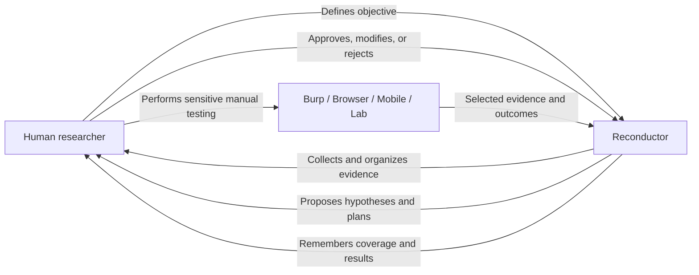

### Core principle

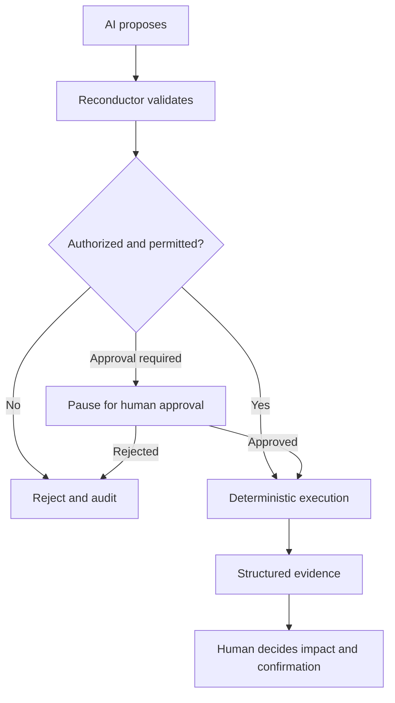

Reconductor is not an autonomous hacker. It is a persistent research partner that helps the user:

- Observe the attack surface.
- Detect meaningful change.
- Understand identity and application state.
- Generate evidence-backed security hypotheses.
- Find testing coverage gaps.
- Prepare safe workflows and manual experiments.
- Preserve investigation history.
- Verify technical evidence.
- Produce clear reports and handoffs.

---

## 2. Completed system at a glance

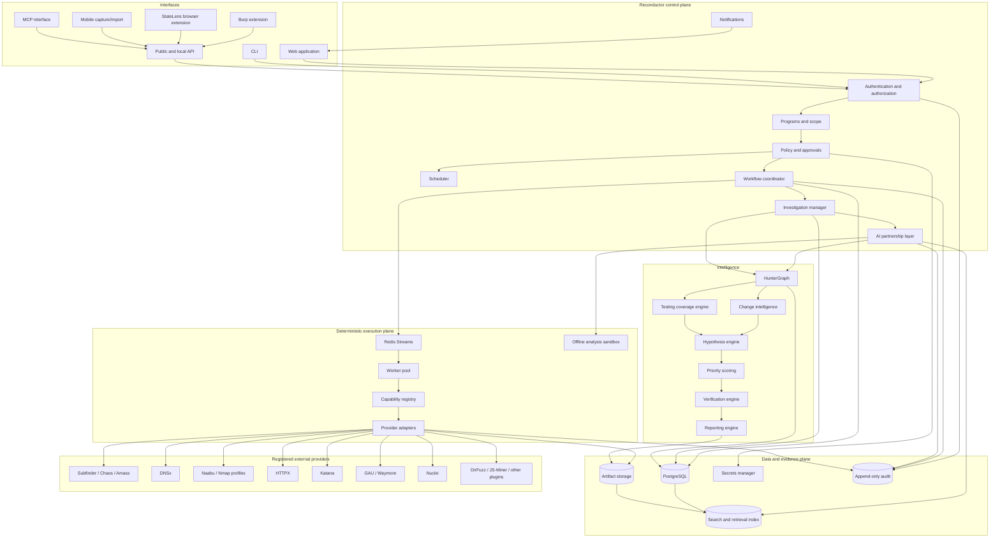

---

## 3. Trust and authority boundaries

### Authority matrix

| Component | Read evidence | Propose actions | Execute passive/low | Execute moderate | Change scope | Confirm vulnerability |
|---|---:|---:|---:|---:|---:|---:|
| Human researcher | Yes | Yes | Yes | Yes | Yes | Yes |
| Read-only AI analyst | Yes | No | No | No | No | No |
| Planning assistant | Yes | Yes | No | No | No | No |
| Supervised investigation agent | Yes | Yes | Within approved plan | Requires pause | No | No |
| Workflow coordinator | Limited | No | After validation | After approval | No | No |
| Worker | Minimum required | No | As instructed | As instructed | No | No |
| Provider plugin | Minimum required | No | As instructed | As instructed | No | No |

### Enforcement chain

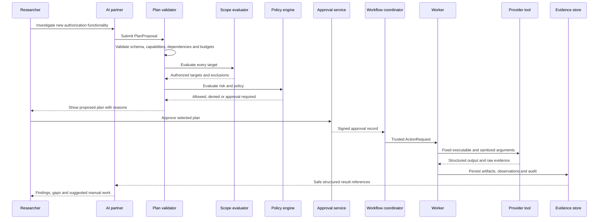

### Non-negotiable AI restrictions

The AI never receives:

- Unrestricted shell access for network activity.
- Arbitrary executable selection.
- Raw command arrays.
- Direct database mutation access.
- Provider secrets.
- Approval bypasses.
- Scope-change authority.
- Authority to confirm a vulnerability.
- Authority to submit a report.

An optional sandbox may run offline parsing, code transformation, clustering, or document analysis. Any network access still goes through registered capabilities.

---

## 4. Program, scope and policy lifecycle

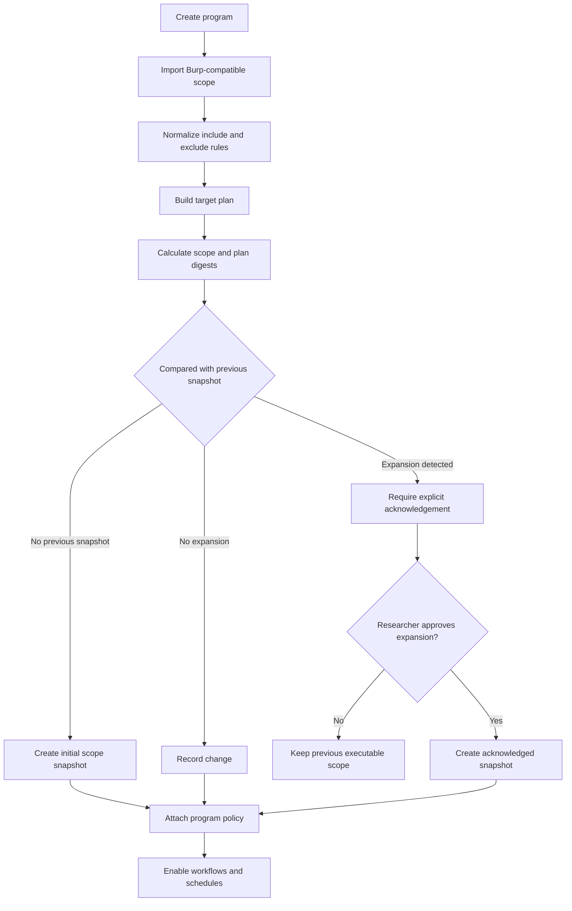

### Scope layers

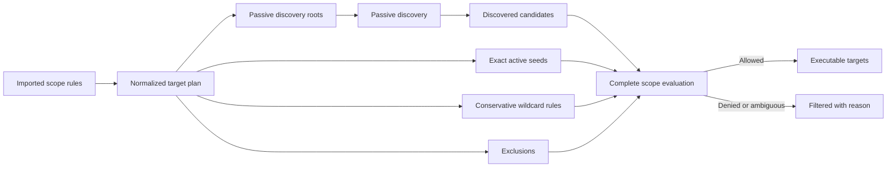

### Policy dimensions

The completed policy engine governs:

- Allowed and denied capabilities.
- Passive, low, moderate, high and forbidden risk.
- HTTP methods.
- Authentication usage.
- Cross-origin activity.
- Headless browser activity.
- Directory discovery.
- Intrusive checks.
- Scan windows.
- Global and per-host rate limits.
- Concurrency.
- Payload size.
- Redirect policy.
- Nuclei tags and severities.
- Artifact retention.
- Sensitive-evidence handling.
- Agent action budgets.
- Provider-specific constraints.

---

## 5. Core execution model

### Persisted hierarchy

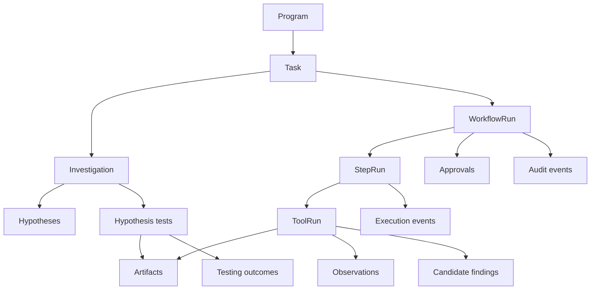

### Workflow state machine

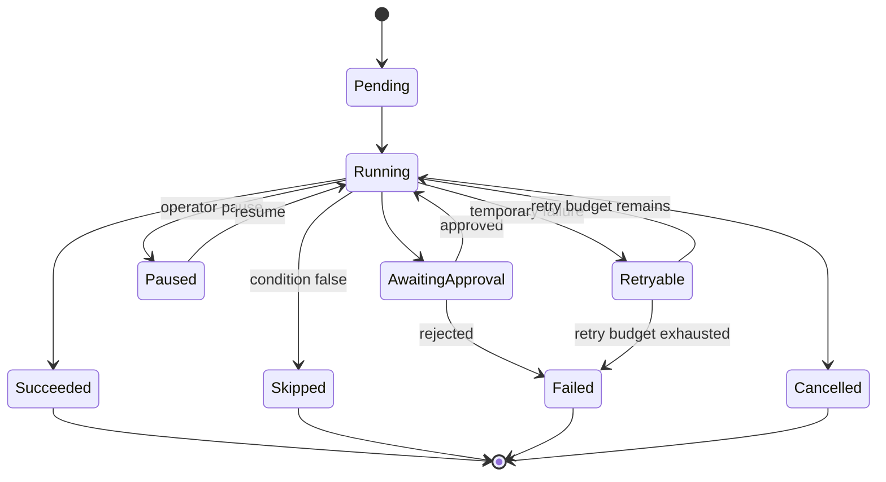

### Durable delivery

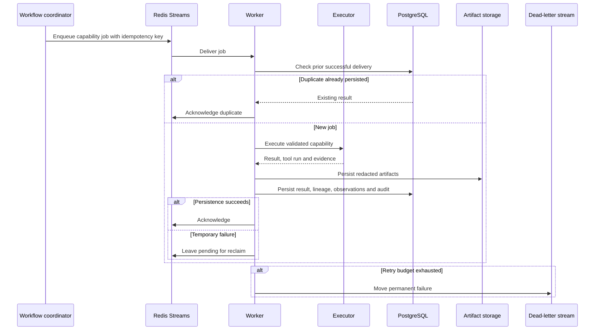

---

## 6. Capability and plugin architecture

### Stable capability contract

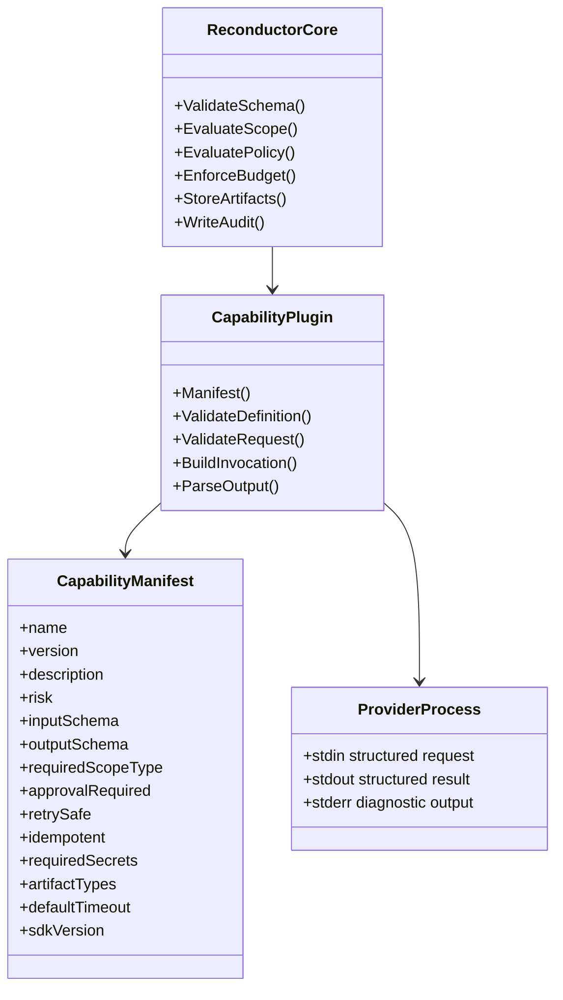

### Plugin safety model

```mermaid
flowchart LR
    PLUGIN[Installed plugin] --> MAN[Signed manifest and checksum]
    MAN --> COMPAT[SDK and version compatibility]
    COMPAT --> PERM[Declared permissions and risk]
    PERM --> SCHEMA[Strict input and output schemas]
    SCHEMA --> TEST[Plugin conformance tests]
    TEST --> REG[Capability registry]
    REG --> EXEC[No-shell supervised process]
    EXEC --> LIMIT[Timeout, output and resource limits]
    LIMIT --> FILTER[Scope and output filtering]
    FILTER --> STORE[Core-controlled persistence]
```

### Example capability groups

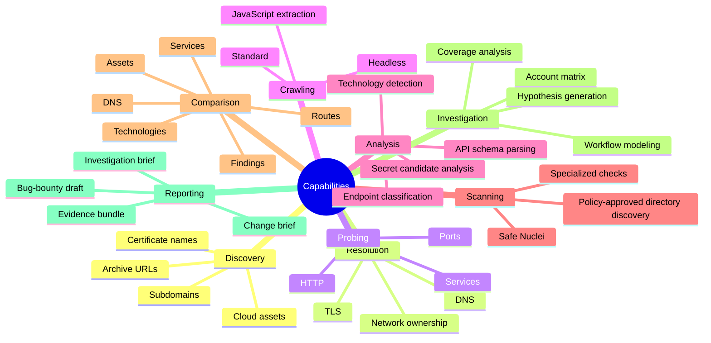

---

## 7. Asset and investigation graph: HunterGraph

HunterGraph is the long-term, program-specific model connecting infrastructure, application behavior, identity, workflows, evidence and testing outcomes.

### Graph domains

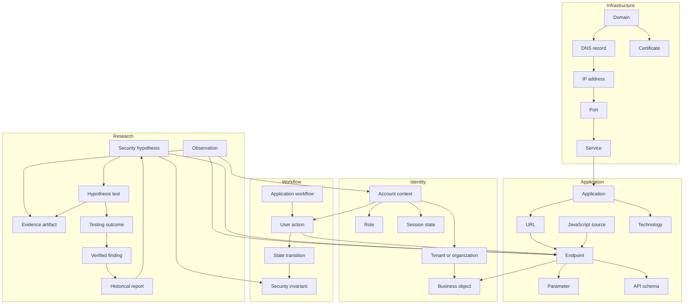

### Example authorization relationship

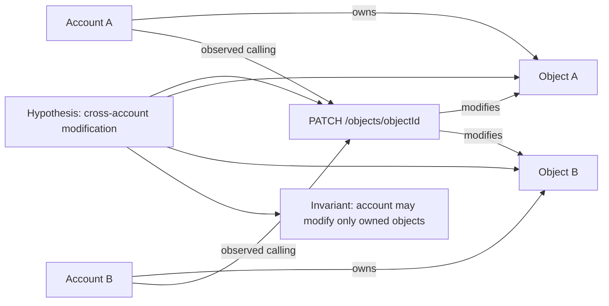

### Evidence-first graph rule

Every significant relationship includes:

- Source capability or manual source.
- Workflow run and tool-run lineage.
- Evidence artifact references.
- First-seen and last-seen timestamps.
- Confidence.
- Scope snapshot.
- Account context where applicable.
- Normalization version.
- Researcher annotations.

---

## 8. Change intelligence

Reconductor compares the current successful observation set with previous compatible snapshots.

### Change pipeline

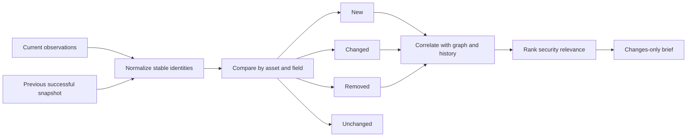

### Compared fields

The completed system can compare:

- Domains and DNS records.
- IP addresses and hosting providers.
- Open ports and detected services.
- Certificates and SANs.
- HTTP status, title and redirect chains.
- Technologies and versions.
- Headers and authentication indicators.
- Content hashes and meaningful content markers.
- Crawled routes.
- JavaScript routes and source maps.
- API schemas and operations.
- Parameters and identifier shapes.
- Nuclei candidates.
- Verified findings.
- Account-observed behavior.
- Workflow and state transitions.

### Security relevance

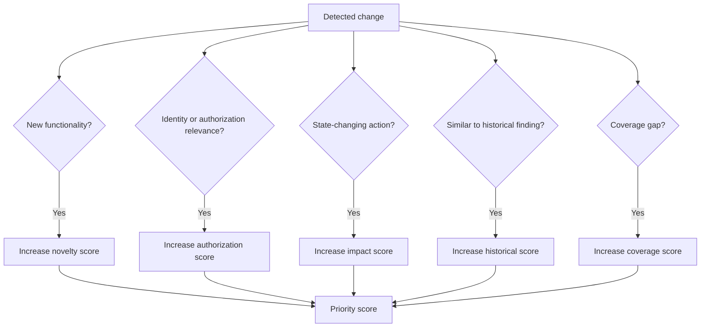

---

## 9. Testing coverage engine

Reconductor records what was tested, under which account and state, against which version of the application.

### Coverage matrix

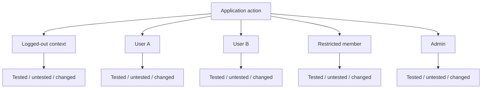

A coverage record contains:

- Program.
- Application and endpoint.
- Action or workflow.
- Account context.
- Source and target object ownership.
- Authentication state.
- Request method and shape.
- Expected security invariant.
- Application observation fingerprint.
- Test date.
- Outcome.
- Evidence.
- Researcher confidence.
- Whether retesting is required after change.

### Retest decision

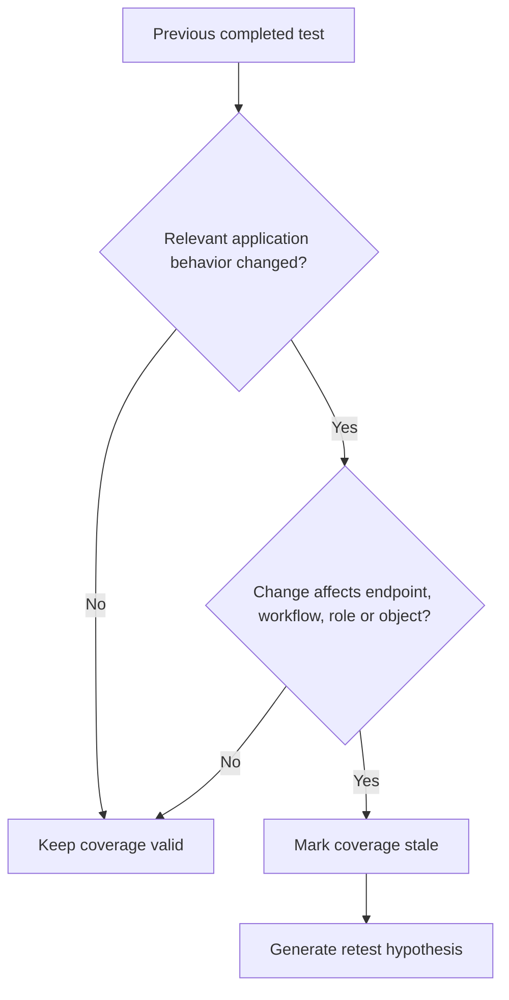

---

## 10. Hypothesis engine

The hypothesis engine combines deterministic rules with optional AI explanation.

### Inputs

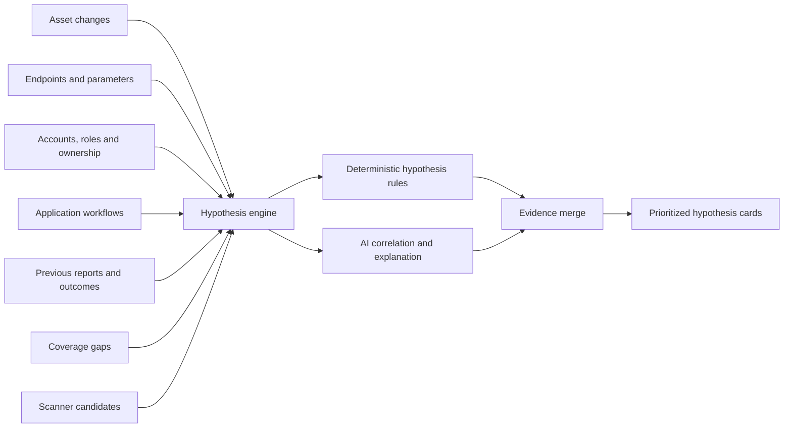

### Hypothesis card

Each card contains:

- Hypothesis title.
- Vulnerability class.
- Why it exists now.
- Potential impact.
- Affected assets and endpoints.
- Required account contexts.
- Required setup.
- Expected security invariant.
- Exact missing coverage.
- Suggested manual validation.
- Relevant provider actions.
- Evidence references.
- Confidence.
- Priority.
- Risk and approval requirements.
- Researcher decision.
- Final testing outcome.

### Example IDOR hypothesis

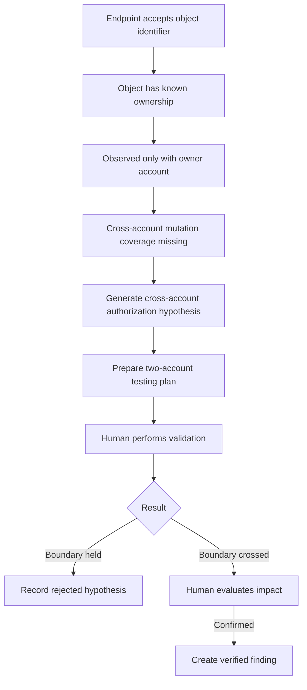

### Common hypothesis families

```mermaid
mindmap
  root((Hypotheses))
    Authorization
      BOLA / IDOR
      Cross-tenant access
      Role escalation
      Function-level authorization
      Ownership transfer
    Authentication
      Recovery workflow
      Session invalidation
      OAuth state and redirect
      Invitation state
      Account linking
    Business logic
      State transition bypass
      Duplicate action
      Limit bypass
      Price or quantity manipulation
      Approval workflow bypass
    Concurrency
      Double redemption
      Duplicate transfer
      Conflicting state update
      Race-assisted authorization
    Data exposure
      Overbroad API response
      Export boundary
      Debug or schema exposure
      Historical object access
    Infrastructure
      New admin service
      Exposed environment
      Misconfiguration
      Known vulnerable component
```

---

## 11. AI partnership layer

### Modes

```mermaid
flowchart LR
    ANALYZE[Analyze mode] --> A1[Read-only summaries and explanations]
    GUIDED[Guided mode] --> G1[Propose one reviewed workflow]
    THOROUGH[Thorough mode] --> T1[Plan, supervised execution and independent verification]
```

#### Analyze mode

- Read-only.
- Explains changes.
- Prioritizes endpoints.
- Reviews coverage.
- Explains failures.
- Produces investigation briefs.
- Cannot submit executable actions.

#### Guided mode

- Produces a `PlanProposal`.
- Human reviews the complete plan.
- Reconductor generates trusted workflow records.
- Passive and low-risk actions may run within the approved plan.
- Moderate actions pause for explicit approval.

#### Thorough mode

- Creates a bounded investigation plan.
- Uses deterministic parallel workers.
- Evaluates results after each phase.
- May propose a limited follow-up round.
- Uses an independent verification phase.
- Stops at hard budgets.
- Never confirms findings without human or deterministic verification.

### Plan, execute and verify

```mermaid
flowchart TD
    OBJ[Human objective] --> CONTEXT[Build bounded context]
    CONTEXT --> PLAN[Planning assistant]
    PLAN --> PROPOSAL[Structured PlanProposal]
    PROPOSAL --> VALIDATE[Deterministic validation]
    VALIDATE --> REVIEW[Human review]
    REVIEW -->|Approve| EXEC[Workflow execution]
    REVIEW -->|Modify| PLAN
    REVIEW -->|Reject| STOP[Stop]
    EXEC --> RESULTS[Structured results]
    RESULTS --> ANALYST[Investigation analysis]
    ANALYST --> VERIFY[Independent verification phase]
    VERIFY --> COMPLETE{Objective complete?}
    COMPLETE -->|Yes| BRIEF[Final investigation brief]
    COMPLETE -->|No and budget remains| FOLLOW[Propose bounded follow-up]
    FOLLOW --> VALIDATE
    COMPLETE -->|No budget| BRIEF
```

### Structured investigation memory

```mermaid
classDiagram
    class InvestigationMemory {
        +investigationId
        +objective
        +confirmedFacts
        +hypotheses
        +coverageGaps
        +completedActions
        +pendingActions
        +evidenceReferences
        +openQuestions
        +researcherDecisions
        +budgetRemaining
        +status
    }

    class Fact {
        +statement
        +sourceIds
        +confidence
        +observedAt
    }

    class Hypothesis {
        +title
        +invariant
        +priority
        +status
        +evidenceIds
    }

    class ActionRecord {
        +capability
        +inputDigest
        +approvalId
        +resultId
        +status
    }

    InvestigationMemory --> Fact
    InvestigationMemory --> Hypothesis
    InvestigationMemory --> ActionRecord
```

### Agent budget

```mermaid
flowchart TD
    START[Start supervised investigation] --> BUDGET[Load hard budget]
    BUDGET --> ROUND[Planning round]
    ROUND --> VALID{Proposal valid?}
    VALID -->|No| INVALID[Increment invalid proposal count]
    INVALID --> LIMIT{Limit reached?}
    LIMIT -->|Yes| STOP[Stop and explain]
    LIMIT -->|No| ROUND
    VALID -->|Yes| RUN[Run approved actions]
    RUN --> COUNT[Update actions, targets, time and cost]
    COUNT --> DONE{Objective satisfied?}
    DONE -->|Yes| FINAL[Produce final brief]
    DONE -->|No| REMAIN{Budget remains?}
    REMAIN -->|Yes| ROUND
    REMAIN -->|No| FINAL
```

Hard budget fields include:

- Maximum planning rounds.
- Maximum actions.
- Maximum targets.
- Maximum duration.
- Maximum model cost.
- Allowed risk levels.
- Maximum moderate-action requests.
- Maximum invalid proposals.
- Maximum evidence retrieval.
- No scope expansion.

### Prompt-injection resistance

```mermaid
flowchart LR
    TARGET[Target-controlled content] --> LABEL[Label as untrusted evidence]
    LABEL --> FILTER[Sanitize and isolate]
    FILTER --> CONTEXT[Bounded context builder]
    SYSTEM[System policy] --> MODEL[AI model]
    CONTEXT --> MODEL
    MODEL --> OUTPUT[Structured output only]
    OUTPUT --> VALIDATOR[Independent validator]
    VALIDATOR -->|Invalid or unsafe| REJECT[Reject and audit]
    VALIDATOR -->|Valid| PROPOSAL[Human-visible proposal]
```

---

## 12. Independent verification and finding lifecycle

### Candidate lifecycle

```mermaid
stateDiagram-v2
    [*] --> New
    New --> Informational
    New --> NeedsManualReview
    New --> QueuedForVerification
    QueuedForVerification --> Verifying
    Verifying --> Rejected
    Verifying --> NeedsManualReview
    Verifying --> Confirmed
    NeedsManualReview --> Verifying
    NeedsManualReview --> Rejected
    NeedsManualReview --> Confirmed
    Confirmed --> VerifiedFinding
    Rejected --> [*]
    Informational --> [*]
    VerifiedFinding --> [*]
```

### Verification paths

```mermaid
flowchart TD
    C[Candidate] --> TYPE{Verification type}
    TYPE -->|Deterministic evidence playbook| D[Run safe verifier]
    TYPE -->|Sensitive or contextual| H[Human manual validation]
    TYPE -->|AI review| A[AI checks consistency only]
    D --> V{Criteria met?}
    V -->|Yes| CONF[Confirmed candidate]
    V -->|No| REJ[Rejected candidate]
    H --> HUMAN{Researcher decision}
    HUMAN -->|Confirmed with impact| FIND[Verified finding]
    HUMAN -->|Not vulnerable| REJ
    HUMAN -->|Unclear| MAN[Needs manual review]
    A --> NOTE[Produce verification questions and gaps]
    NOTE --> H
    CONF --> H
```

AI can detect contradictions, missing evidence and incomplete testing, but cannot promote a candidate directly to a verified finding.

---

## 13. Integrations with the researcher's tools

### StateLens

```mermaid
flowchart LR
    BROWSER[Browser workflow] --> STATE[StateLens]
    STATE --> PROJECT[Project and scope context]
    STATE --> ACCOUNT[Account context]
    STATE --> ACTION[Action markers]
    STATE --> REQUEST[Selected network observations]
    PROJECT --> API[Reconductor ingestion API]
    ACCOUNT --> API
    ACTION --> API
    REQUEST --> API
    API --> GRAPH[HunterGraph]
    GRAPH --> HYP[Identity-aware hypotheses]
```

### Burp Suite

```mermaid
flowchart LR
    PROXY[Proxy history] --> EXT[Reconductor Burp extension]
    REPEATER[Repeater] --> EXT
    LOGGER[Logger] --> EXT
    EXT --> SELECT[Researcher selects evidence]
    SELECT --> REDACT[Local redaction preview]
    REDACT --> IMPORT[Import request, response and account context]
    IMPORT --> GRAPH[HunterGraph]
    GRAPH --> MATRIX[Authorization matrix]
    MATRIX --> PLAN[Manual test plan]
    PLAN --> REPEATER
```

The integration is researcher-directed. Reconductor does not silently import all sensitive traffic.

### H1Vault

```mermaid
flowchart LR
    H1[HackerOne report archive] --> VAULT[H1Vault]
    VAULT --> PARSE[Normalize report metadata]
    PARSE --> CLASS[Vulnerability class and object types]
    PARSE --> OUTCOME[Resolution and severity]
    PARSE --> PROGRAM[Program-specific history]
    CLASS --> GRAPH[HunterGraph]
    OUTCOME --> GRAPH
    PROGRAM --> GRAPH
    GRAPH --> SIM[Historical similarity scoring]
    SIM --> HYP[Prioritized hypotheses]
```

### JS-Miner and source analysis

```mermaid
flowchart LR
    JS[JavaScript files] --> MINER[JS-Miner provider]
    MAP[Source maps] --> MINER
    MINER --> ROUTES[Routes]
    MINER --> PARAMS[Parameters]
    MINER --> SECRETS[Secret candidates]
    MINER --> SERVICES[Referenced services]
    ROUTES --> GRAPH[HunterGraph]
    PARAMS --> GRAPH
    SECRETS --> VERIFY[Verification candidates]
    SERVICES --> SCOPE[Scope evaluation]
```

### Mobile and API imports

```mermaid
flowchart LR
    IOS[iOS capture] --> IMPORT[Controlled evidence import]
    ANDROID[Android capture] --> IMPORT
    POSTMAN[Postman or OpenAPI] --> IMPORT
    HAR[HAR file] --> IMPORT
    IMPORT --> REDACT[Redaction and sensitivity classification]
    REDACT --> NORMALIZE[Normalize requests, endpoints and workflows]
    NORMALIZE --> GRAPH[HunterGraph]
```

---

## 14. Completed user experience

### Primary navigation

```mermaid
flowchart LR
    HOME[Home] --> PROGRAMS[Programs]
    PROGRAMS --> OVERVIEW[Program overview]
    OVERVIEW --> SCOPE[Scope and policy]
    OVERVIEW --> ATTACK[Attack surface]
    OVERVIEW --> CHANGES[Changes]
    OVERVIEW --> INVEST[Investigations]
    OVERVIEW --> HYP[Hypotheses]
    OVERVIEW --> COVERAGE[Coverage]
    OVERVIEW --> FINDINGS[Findings]
    OVERVIEW --> RUNS[Workflow runs]
    OVERVIEW --> EVIDENCE[Evidence]
    OVERVIEW --> REPORTS[Reports]
    OVERVIEW --> SETTINGS[Integrations and settings]
```

### Program dashboard

```mermaid
flowchart TB
    SUMMARY[Program summary]
    SUMMARY --> S1[Scope health]
    SUMMARY --> S2[Latest successful run]
    SUMMARY --> S3[New and changed assets]
    SUMMARY --> S4[Open investigations]
    SUMMARY --> S5[Top hypotheses]
    SUMMARY --> S6[Coverage gaps]
    SUMMARY --> S7[Candidates awaiting review]
    SUMMARY --> S8[Verified findings]
    SUMMARY --> S9[Upcoming schedules]
    SUMMARY --> S10[Worker and provider health]
```

### What should I test next?

```mermaid
flowchart TD
    DATA[Graph, changes, coverage and history] --> SCORE[Deterministic priority scoring]
    SCORE --> AI[AI explanation]
    AI --> CARDS[Top five investigation cards]
    CARDS --> WHY[Why selected]
    CARDS --> SETUP[Accounts and setup required]
    CARDS --> ENDPOINTS[Exact endpoints and actions]
    CARDS --> INVARIANT[Expected security invariant]
    CARDS --> EVIDENCE[Supporting evidence]
    CARDS --> TEST[Manual validation plan]
    CARDS --> ACTION[Researcher starts, modifies, dismisses or defers]
```

### Live run view

```mermaid
flowchart LR
    GRAPH[Workflow graph] --> STATUS[Live step status]
    STATUS --> LOGS[Sanitized logs]
    STATUS --> APPROVALS[Pending approvals]
    STATUS --> ARTIFACTS[Generated artifacts]
    STATUS --> EVENTS[Audit and state events]
    STATUS --> CONTROLS[Pause, resume, cancel and retry]
```

### Investigation workspace

```mermaid
flowchart TB
    OBJ[Objective] --> FACTS[Confirmed facts]
    OBJ --> QUESTIONS[Open questions]
    OBJ --> HYP[Hypotheses]
    HYP --> TESTS[Test plans]
    TESTS --> ACCOUNTS[Account contexts]
    TESTS --> REQUESTS[Relevant requests]
    TESTS --> EVIDENCE[Evidence]
    TESTS --> OUTCOMES[Outcomes]
    OUTCOMES --> COVERAGE[Coverage update]
    OUTCOMES --> FINDING[Finding decision]
    FINDING --> REPORT[Report draft]
```

---

## 15. End-to-end journey: continuous recon

```mermaid
sequenceDiagram
    participant S as Scheduler
    participant P as Program policy
    participant C as Workflow coordinator
    participant W as Workers
    participant G as HunterGraph
    participant I as Intelligence engine
    participant U as Researcher

    S->>P: Request scheduled baseline
    P-->>S: Allowed within scan window and budget
    S->>C: Create workflow run
    C->>W: Passive discovery and active baseline jobs
    W-->>C: Structured observations and artifacts
    C->>G: Persist current observation snapshot
    G->>G: Compare against previous successful snapshot
    G->>I: New, changed and removed relationships
    I->>I: Score relevance and coverage gaps
    I-->>U: Changes-only brief
    U->>I: Open investigation on selected change
```

---

## 16. End-to-end journey: human-led authorization investigation

```mermaid
sequenceDiagram
    participant U as Researcher
    participant R as Reconductor
    participant A as AI partner
    participant G as HunterGraph
    participant B as Burp and StateLens
    participant V as Verification engine

    U->>R: Investigate account and tenant boundaries
    R->>G: Load endpoints, workflows, roles and prior coverage
    G-->>A: Bounded evidence context
    A-->>U: Five prioritized authorization hypotheses
    U->>R: Select cross-tenant member modification
    R-->>U: Show required accounts, invariant and exact evidence
    U->>B: Perform controlled two-account test
    B->>R: Import selected request, response and outcome
    R->>G: Link evidence to account, endpoint and object
    G->>V: Evaluate evidence completeness
    V-->>U: Boundary crossed; impact confirmation required
    U->>R: Confirm impact and mark vulnerability
    R->>R: Create verified finding and update coverage
    R-->>U: Generate report draft and evidence bundle
```

---

## 17. End-to-end journey: AI-guided investigation

```mermaid
sequenceDiagram
    participant U as Researcher
    participant AI as Investigation assistant
    participant V as Validator
    participant H as Approval service
    participant C as Coordinator
    participant W as Workers
    participant G as HunterGraph

    U->>AI: Investigate important changes in the latest run
    AI->>G: Request bounded relevant context
    G-->>AI: Changes, evidence, history and coverage
    AI->>V: Structured PlanProposal
    V-->>U: Validated plan with risks, targets and reasons
    U->>H: Approve plan
    H-->>C: Approval record
    C->>W: Execute passive and low-risk actions
    W-->>G: New observations and artifacts
    G-->>AI: Structured result summary
    AI-->>U: Updated hypotheses and manual testing brief
    U->>AI: Reject one hypothesis and explain why
    AI->>G: Record researcher decision
    AI-->>U: Revised priority list
```

---

## 18. End-to-end journey: candidate to verified finding

```mermaid
flowchart TD
    SCAN[Scanner or analysis match] --> CAND[Candidate finding]
    CAND --> ENRICH[Attach asset, endpoint, evidence and history]
    ENRICH --> DEDUPE[Deduplicate and correlate]
    DEDUPE --> SCORE[Score confidence and impact potential]
    SCORE --> PATH{Verification path}
    PATH -->|Safe deterministic| PLAY[Verification playbook]
    PATH -->|Contextual| MANUAL[Manual researcher test]
    PATH -->|Insufficient evidence| HOLD[Needs review]
    PLAY --> VERDICT{Criteria met?}
    VERDICT -->|No| REJECT[Rejected candidate]
    VERDICT -->|Yes| HUMAN[Human impact review]
    MANUAL --> HUMAN
    HUMAN --> DECIDE{Confirmed security impact?}
    DECIDE -->|No| REJECT
    DECIDE -->|Yes| FIND[Verified finding]
    FIND --> REPORT[Report and evidence bundle]
    REPORT --> HISTORY[Program memory and future similarity]
```

---

## 19. Reporting and evidence

### Report generation

```mermaid
flowchart LR
    FINDING[Verified finding] --> FACTS[Confirmed technical facts]
    EVIDENCE[Artifacts and requests] --> FACTS
    TIMELINE[Investigation timeline] --> FACTS
    IMPACT[Researcher-confirmed impact] --> DRAFT[Report generator]
    FACTS --> DRAFT
    DRAFT --> REVIEW[Researcher review]
    REVIEW -->|Edit| DRAFT
    REVIEW -->|Approve| EXPORT[Markdown, HTML, PDF or platform format]
```

### Report sections

- Title.
- Program and asset.
- Vulnerability class.
- Severity rationale.
- Summary.
- Prerequisites and account contexts.
- Reproduction steps.
- Expected versus observed behavior.
- Impact.
- Supporting evidence.
- Timeline.
- Suggested remediation.
- Testing limitations.
- Artifact manifest and hashes.

### Evidence bundle

```mermaid
flowchart TD
    BUNDLE[Evidence bundle] --> MANIFEST[Manifest]
    BUNDLE --> REQUESTS[Sanitized requests and responses]
    BUNDLE --> SCREEN[Selected screenshots]
    BUNDLE --> LOGS[Relevant provider outputs]
    BUNDLE --> GRAPH[Relationship snapshot]
    BUNDLE --> TIMELINE[Investigation timeline]
    BUNDLE --> HASHES[SHA-256 hashes]
    BUNDLE --> REDACTION[Redaction report]
```

---

## 20. Security, privacy and audit

### Security controls

```mermaid
flowchart TB
    INPUT[Input] --> AUTHZ[User and program authorization]
    AUTHZ --> SCHEMA[Schema validation]
    SCHEMA --> SCOPE[Scope validation]
    SCOPE --> POLICY[Policy evaluation]
    POLICY --> APPROVAL[Approval verification]
    APPROVAL --> EXEC[No-shell execution]
    EXEC --> RESOURCE[Resource and timeout limits]
    RESOURCE --> OUTPUT[Output parsing and filtering]
    OUTPUT --> REDACT[Redaction]
    REDACT --> CLASSIFY[Sensitivity classification]
    CLASSIFY --> STORE[Controlled storage]
    STORE --> AUDIT[Immutable audit record]
```

### Audit event categories

- Login and permission changes.
- Program creation.
- Scope import and expansion.
- Policy changes.
- Schedule creation.
- Workflow creation.
- AI context retrieval.
- AI model request and output digests.
- Plan validation decisions.
- Approvals and rejections.
- Provider execution.
- Artifact access.
- Evidence export.
- Finding status changes.
- Report generation and export.
- Plugin installation and update.

### Sensitive evidence

```mermaid
flowchart LR
    RAW[Raw evidence] --> DETECT[Secret and personal-data detection]
    DETECT --> SAFE[Redacted normal artifact]
    DETECT --> SENSITIVE[Restricted sensitive artifact]
    SAFE --> NORMAL[Normal retention policy]
    SENSITIVE --> ACCESS[Additional access control]
    ACCESS --> SHORT[Shorter retention or manual preservation]
    SAFE --> HASH[Integrity hash]
    SENSITIVE --> HASH
```

---

## 21. Deployment architecture

### Single-node self-hosted deployment

```mermaid
flowchart TB
    USER[Researcher browser and CLI] --> REVERSE[Local reverse proxy]
    REVERSE --> WEB[Reconductor API and web service]
    WEB --> PG[(PostgreSQL)]
    WEB --> REDIS[(Redis)]
    WEB --> STORE[(Local or S3-compatible artifacts)]
    WEB --> AI[Local or remote model gateway]
    REDIS --> WORKER1[Worker]
    REDIS --> WORKER2[Worker]
    WORKER1 --> TOOLS1[Bundled provider tools]
    WORKER2 --> TOOLS2[Bundled provider tools]
```

### Scaled deployment

```mermaid
flowchart TB
    USERS[Researchers] --> LB[Load balancer]
    LB --> API1[API instance]
    LB --> API2[API instance]
    API1 --> PG[(Managed PostgreSQL)]
    API2 --> PG
    API1 --> REDIS[(Redis cluster)]
    API2 --> REDIS
    API1 --> OBJ[(S3-compatible object storage)]
    API2 --> OBJ
    REDIS --> WP1[Worker pool A]
    REDIS --> WP2[Worker pool B]
    REDIS --> WP3[Specialized browser workers]
    WP1 --> EGRESS[Controlled egress]
    WP2 --> EGRESS
    WP3 --> EGRESS
    API1 --> MODEL[Model gateway]
    API2 --> MODEL
    MODEL --> LOCAL[Local models]
    MODEL --> CLOUD[Optional cloud providers]
```

### Environment health

```mermaid
flowchart LR
    DOCTOR[platform doctor] --> DB[PostgreSQL]
    DOCTOR --> REDIS[Redis]
    DOCTOR --> STORE[Artifact storage]
    DOCTOR --> TOOLS[Provider identity and versions]
    DOCTOR --> TEMPLATES[Nuclei template snapshot]
    DOCTOR --> PLUGINS[Plugin compatibility]
    DOCTOR --> MODEL[Model configuration]
    DOCTOR --> POLICY[Policy configuration]
    DB --> REPORT[Health report]
    REDIS --> REPORT
    STORE --> REPORT
    TOOLS --> REPORT
    TEMPLATES --> REPORT
    PLUGINS --> REPORT
    MODEL --> REPORT
    POLICY --> REPORT
```

---

## 22. Main data model

```mermaid
erDiagram
    USER ||--o{ PROGRAM_MEMBERSHIP : has
    PROGRAM ||--o{ PROGRAM_MEMBERSHIP : includes
    PROGRAM ||--o{ SCOPE_SNAPSHOT : owns
    PROGRAM ||--o{ POLICY : uses
    PROGRAM ||--o{ TASK : owns
    PROGRAM ||--o{ ASSET : contains
    PROGRAM ||--o{ INVESTIGATION : contains

    TASK ||--o{ WORKFLOW_RUN : creates
    WORKFLOW_RUN ||--o{ STEP_RUN : contains
    STEP_RUN ||--o{ TOOL_RUN : contains
    TOOL_RUN ||--o{ ARTIFACT : produces
    WORKFLOW_RUN ||--o{ OBSERVATION : produces
    WORKFLOW_RUN ||--o{ APPROVAL : requires
    WORKFLOW_RUN ||--o{ AUDIT_EVENT : records

    ASSET ||--o{ OBSERVATION : has
    ASSET ||--o{ ENDPOINT : exposes
    ENDPOINT ||--o{ PARAMETER : accepts

    INVESTIGATION ||--o{ HYPOTHESIS : contains
    HYPOTHESIS ||--o{ HYPOTHESIS_TEST : evaluated_by
    HYPOTHESIS_TEST ||--o{ TEST_EVIDENCE : uses
    HYPOTHESIS_TEST ||--o{ TEST_OUTCOME : produces
    HYPOTHESIS_TEST ||--o{ COVERAGE_RECORD : updates

    ACCOUNT_CONTEXT ||--o{ COVERAGE_RECORD : scopes
    APPLICATION_WORKFLOW ||--o{ WORKFLOW_ACTION : contains
    WORKFLOW_ACTION ||--o{ COVERAGE_RECORD : measured_by

    CANDIDATE_FINDING ||--o{ VERIFICATION_RESULT : evaluated_by
    VERIFICATION_RESULT }o--|| VERIFIED_FINDING : promotes_to
    VERIFIED_FINDING ||--o{ REPORT : documented_by

    GRAPH_ENTITY ||--o{ GRAPH_RELATION : source
    GRAPH_ENTITY ||--o{ GRAPH_RELATION : target
    GRAPH_RELATION ||--o{ EVIDENCE_LINK : supported_by
    ARTIFACT ||--o{ EVIDENCE_LINK : referenced_by
```

---

## 23. Notifications and recurring operation

```mermaid
flowchart TD
    EVENT[Platform event] --> RULES[Notification rules]
    RULES --> IMPORTANT{Meaningful?}
    IMPORTANT -->|No| STORE[Store silently]
    IMPORTANT -->|Yes| CHANNEL{Selected channel}
    CHANNEL --> WEB[In-app notification]
    CHANNEL --> EMAIL[Email]
    CHANNEL --> SLACK[Slack or webhook]
    CHANNEL --> DIGEST[Daily or weekly digest]
```

Meaningful notifications include:

- Scope expansion awaiting acknowledgement.
- Moderate action awaiting approval.
- Provider or worker health failure.
- Workflow failure after retries.
- New high-priority asset.
- New authorization-relevant endpoint.
- New hypothesis above threshold.
- Candidate requiring manual review.
- Verification completed.
- Scheduled investigation brief ready.

---

## 24. Success criteria

Reconductor is complete when it can reliably answer:

1. **What changed?**
2. **Why does it matter?**
3. **What have I already tested?**
4. **Which account, role, object and state were involved?**
5. **What should I test next?**
6. **What evidence supports that recommendation?**
7. **Which safe workflow would close the gap?**
8. **What requires my approval?**
9. **What still requires manual judgment?**
10. **What did we learn and remember afterward?**

### Final partnership loop

```mermaid
flowchart LR
    OBSERVE[Observe] --> ORGANIZE[Organize evidence]
    ORGANIZE --> UNDERSTAND[Understand relationships]
    UNDERSTAND --> HYPOTHESIZE[Generate hypotheses]
    HYPOTHESIZE --> PRIORITIZE[Prioritize]
    PRIORITIZE --> PROPOSE[Propose next work]
    PROPOSE --> HUMAN[Human decision and testing]
    HUMAN --> VERIFY[Verify evidence and impact]
    VERIFY --> REMEMBER[Remember coverage and outcome]
    REMEMBER --> OBSERVE
```

---

## 25. Final positioning

```mermaid
flowchart TD
    GENERIC[Generic recon tools] -->|Find assets and known issues| BASELINE[Baseline value]
    AUTONOMOUS[Autonomous security agents] -->|Act broadly with reduced human control| AUTO[Automation value]
    RECONDUCTOR[Reconductor] -->|Evidence, identity, workflows, memory and partnership| PARTNER[Human-led investigation value]
```

> **Reconductor is an evidence-driven partner for human-led security research.**
>
> It combines deterministic reconnaissance, strict scope and policy enforcement, persistent attack-surface memory, identity-aware investigation, testing coverage, evidence-backed hypotheses, supervised AI assistance, independent verification, and researcher-controlled reporting.
>
> The platform performs the repetitive work, preserves context, and surfaces the best next decisions. The researcher remains in charge of the investigation.
